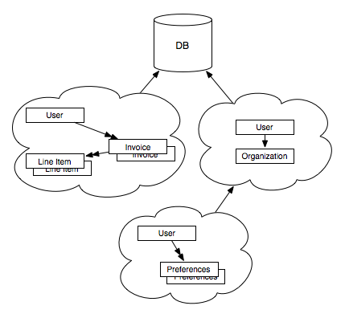

# Cayenne Contexts

The "context" concept is one of the signature features of Cayenne.  Although there are a few different types (BaseContext, CayenneContext, DataContext -- all implementations of the ObjectContext interface), the principal one for most people is the DataContext and we will generally refer to contexts as a DataContext unless specifically pointing out something from the others.

The DataContext is where your DataObjects -- the Java objects which map to your database records -- live.  The DataContext is used to perform queries, inserts, updates, deletes, and generally manage your database transactions.  All DataObjects managed by Cayenne are managed by a DataContext.  All DataObjects know the DataContext they live in and all DataContexts know which DataObjects they are tracking.

A DataContext gives you the ability to:

* work with objects without an activate database transaction,
* commit from one DataContext into another (child or nested contexts),
* toss a DataContext away without keeping any changes made,
* work with many independent sets of data (especially in a web application),
* rollback a DataContext when necessary.

In some ways, a DataContext works similarly to a versioning control system (VCS), such as Subversion or Git.  In a VCS, you check out source code into a workspace from a source repository.  From Cayenne's perspective, the workspace would be a DataContext and the source repository the database.  A VCS allows many workspaces (for different users or even the same user) where changes (creating, deleting, or modifying files) are made and tracked and eventually committed back to the central repository.  A Cayenne DataContext performs a job similar to a workspace by tracking changes to DataObjects until you commit the changes to the database.

The following table shows common DataContext operations and how it mirrors common VCS operations:

Cayenne DataContext | Versioning Control System
------------------- | -------------------------
performQuery()      | Checkout
commitChanges()     | Commit
deletedObjects(), newObjects(), modifiedObjects(), hasChanges() | Status
newObject()         | Add
rollbackChanges()   | Revert

Obviously there are many more methods associated with a DataContext, but these basic methods will take you far.

As mentioned, an application isn't restricted to one DataContext, just as a VCS isn't restricted to one workspace.  An application can have as many DataContexts as needed (memory-permitting, of course), including many DataContexts for a single user.  These DataContexts can be peers or children (nested DataContexts).  A child DataContext can be created from any DataContext and is useful for isolating changes you may ultimately decide not commit, such as when creating a "wizard" interface.  You can create an object graph in the child DataContext and at the end of the wizard, commit everything to the parent and to the database or if the user abandons the wizard, discard the child DataContext and the parent DataContext is unaltered.

  
   
  Two Peer DataContexts and a Child DataContext

So, how do you know how many DataContexts to create?  That's a good question, but hard to answer.  A web application developer might choose the pattern of one DataContext for every user session, but another web application developer might choose the pattern of one DataContext for every request.  Some might choose multiple DataContexts for each user.  Some might use child DataContexts from a session-scoped DataContext.  Others might choose a hybrid approach.  It is up to the developer to determine the best approach for their application usage and requirements.  There is no single pattern that is appropriate for every situation.  Cayenne provides quite a bit of flexibility in choosing patterns that fit your needs.

Rather than dwell on the DataContext here, it will be explained and demonstrated extensively later on -- after all, every example will have at least one DataContext.  To use Cayenne effectively, you need to understand proper uses of the DataContext.  With that in mind, pay attention in the examples of how the DataContext is used.