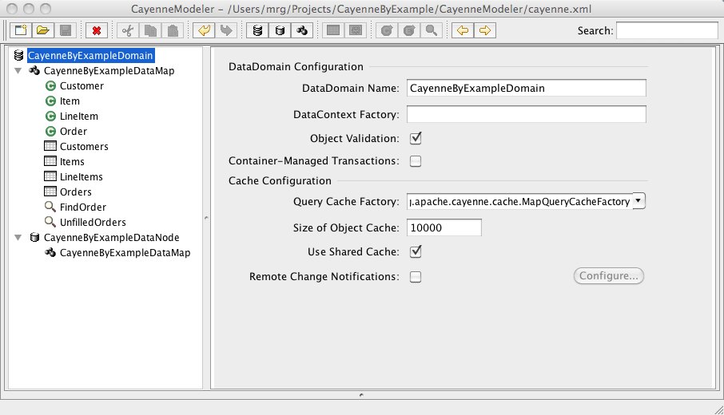

# Cayenne Modeler

Cayenne Modeler is a cross-platform GUI application for modeling your database schema and mapping the database to Java classes.  It is often someone's first experience with using the Cayenne framework.  It provides a friendlier introduction to Cayenne without having to learn the underlying XML mapping files or having to learn the proper way to structure Java classes to work with Cayenne.  Of course, you can always manipulate the XML model files by hand if you choose to, but most developers rarely look at them and rely mainly on Cayenne Modeler for managing the model files.

The main purpose of Cayenne modeler, outside of shielding humans from the XML file formats, is to edit DataDomains, DataMaps, and DataNodes.  These Cayenne features will be described more fully later on, but they provide the main mapping from the database layer to the Java layer.

## <a name="startup">Startup</a>

When you run Cayenne Modeler you are presented with a splash screen.  You can create new projects, open existing projects, and also see a listing of your recent projects which you can select to open one of them.

  
   
  Splash Screen

## <a name="main_window">Main Window</a>

Once a model is open (newly created or opening an existing one), the main Cayenne Modeler window is divided into a main toolbar on the top, navigation pane (for the DataDomain, DataMap, and DataNode browser) on the left, and context-specific detail views on the right.  The main window, especially the detail views, is where the majority of interaction occurs.

  
   
  Main Window - Existing Project

When opening an existing project the navigation pane will show the existing DataDomains, DataMaps, and DataNodes already defined for the project.  When creating a brand new project, you'll need to create these entities using the toolbar.

### <a name="main_toolbar">Main Toolbar</a>

The main toolbar contains context-sensitive shortcuts for common tasks (most can be found in the menu, too).  It also contains a search field to search through the model, which can be very handy in large models.

<table>
  <tr>
    <td class="center">
      
      
      
    </td>
    <td class="center">
      New Project, Open Project, Save Project
    </td>
  </tr>
  <tr>
    <td class="center">
      
    </td>
    <td class="center">
      Delete Selected Item
    </td>
  </tr>
  <tr>
    <td class="center">
      
      
      
    </td>
    <td class="center">
      Cut, Copy, Paste
    </td>
  </tr>
  <tr>
    <td class="center">
      
      
    </td>
    <td class="center">
      Undo, Redo
    </td>
  </tr>
  <tr>
    <td class="center">
      
      
      
    </td>
    <td class="center">
      Create: DataDomain, DataNode, DataMap
    </td>
  </tr>
  <tr>
    <td class="center">
      
      
    </td>
    <td class="center">
      Create: DbEntity (Database Entity), Stored Procedure
    </td>
  </tr>
  <tr>
    <td class="center">
      
      
      
    </td>
    <td class="center">
      Create: ObjEntity (Java Class), Embeddable, Query
    </td>
  </tr>
  <tr>
    <td class="center">
      
      
    </td>
    <td class="center">
      Navigate: Backward, Forward
    </td>
  </tr>
</table>

### <a name="navigation_pane">Navigation Pane</a>

The navigation pane sits on the left side of the main window and is used to navigate around DataDomains, DataMaps, and DataNodes in the model.  Selecting a DataDomain, DataMap, DataNode or any of their sub-entities displays a context-sensitive detail pane editor on the right side of the main window.

#### <a name="domain_map_node">DataDomain, DataMap, DataNode</a>

The navigation pane is, in essence, a DataDomain, DataMap, and DataNode browser.  It allows you to select and edit the primary elements Cayenne uses to access the database and map database tables to Java classes.

A DataDomain contains a collection of DataMaps and DataNodes, plus some common configuration information that the DataMaps and DataNodes will share, such as caching information.  Although a Cayenne model can contain multiple DataDomains, there is typically only one.

A DataMap contains the mapping information between the database and your Java classes.  It is divided into DbEntities which describe the database tables and columns, ObjEntities which describe the Java classes and attributes mapped to the database tables, and optional named queries and stored procedures.  Every DataMap resides in a DataDomain and is also associated with a single DataNode.

A DataNode contains database connection information.  Cayenne includes three ways to login and access the database, but the mechanism is user-extendable.  One method is for Cayenne to manage the database connection pool itself.  A second method is to use JNDI lookups, which is useful in web applications when letting the container (such as Tomcat or JBoss) manage the database connection pool.  A third is to use Apache DBCP.  The examples in this book will primarily let Cayenne manage the database connections since they are standalone examples.

A DataMap is connected to a single DataNode which is used to route traffic to the database.  Typically there is only one DataMap and one DataNode, but it is possible to have multiple DataMaps and one DataNode (sharing the same database channel).  Another option is to have multiple DataMaps mapped to multiple DataNodes, which is required when Cayenne must access different databases at the same time (such as an Oracle and a MySQL database or two different Oracle databases).  You cannot have a single DataMap connected to multiple DataNodes, though, because Cayenne would not know how to route the traffic in that case.

**NOTE: Cayenne 3.1 is moving to a single DataDomain in a model.  This is by far the most common use case and allowing multiple DataDomains in a model tends to cause confusion among new users, so this is being simplified.  You should avoid creating multiple DataDomains in a model in Cayenne 3.0 because of this upcoming change.**

### Detail Pane

The detail pane sits on the right side of the main window and is used to display context-sensitive detail editors for DataDomains, DataMaps, DataNodes, and their sub-entities.

## DataDomain Editor

### DataDomain Configuration

### Cache Configuration

## DataMap Editor

### DbEntities - Modeling the Database

#### Entity

#### Attributes

#### Relationships

### ObjEntities - Modeling the Java Classes

#### Entity

#### Attributes

#### Relationships

#### Callbacks

#### Listeners

## DataNode Editor

### Main

### Adapter

### Password Encoder

## Generate Classes

## Reverse Engineer Schema

## Preferences

### General

### Local Data Sources

### Classpath

### Templates

